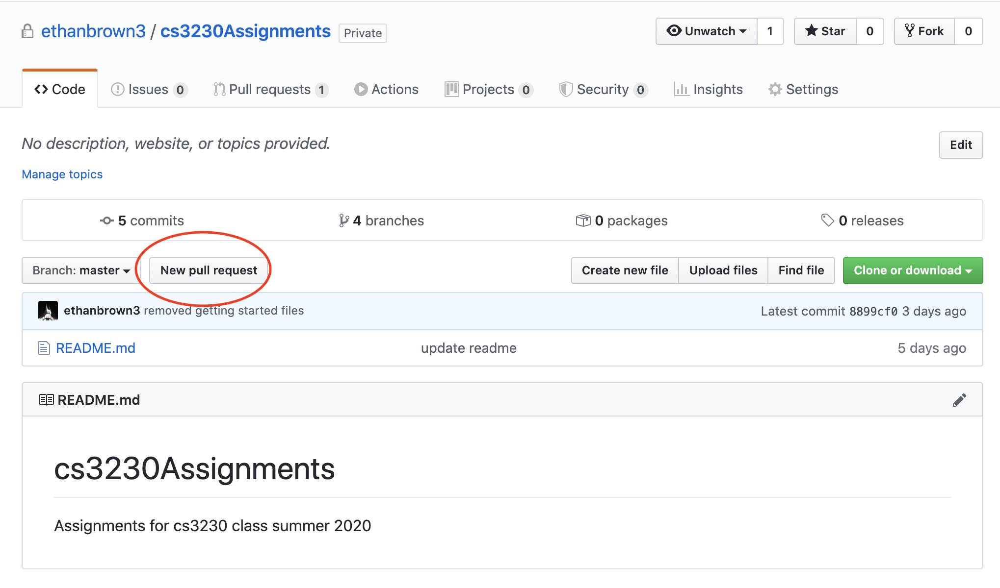
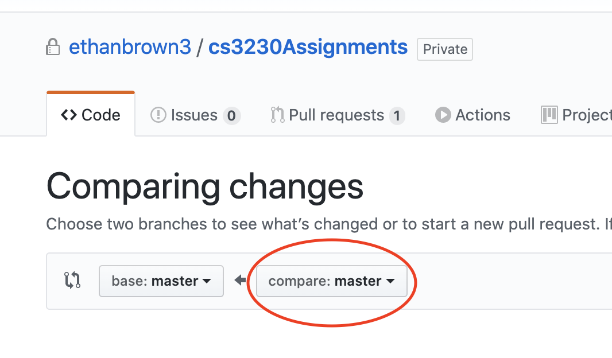
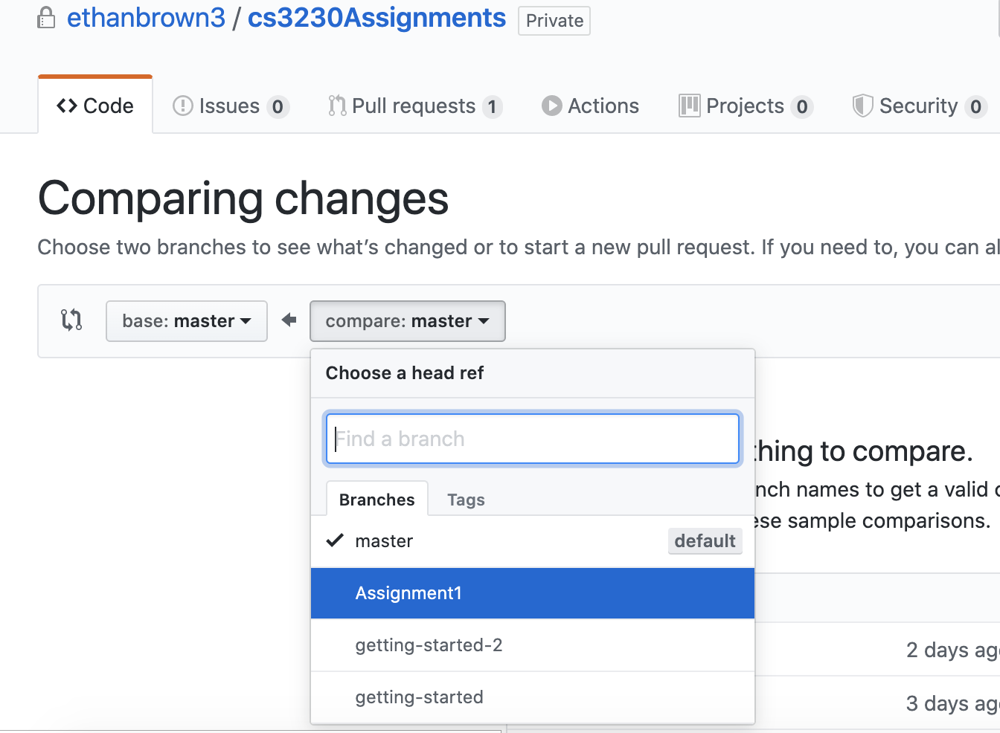
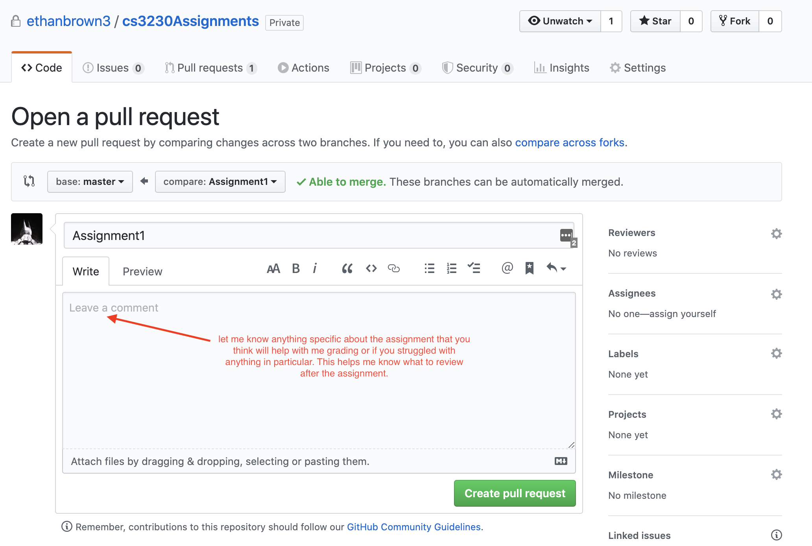
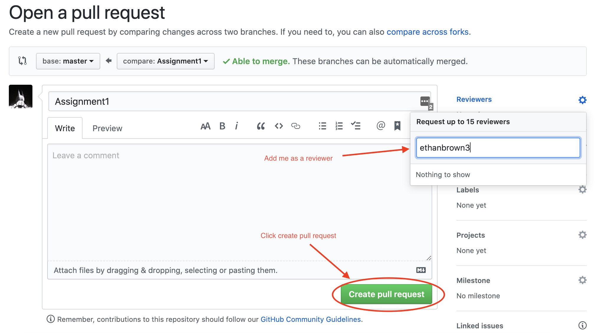

# How to Create a Pull Request #

After you have finished your assignment and pushed all of your commits to git hub you need to create a pull request for me to review and grade.

1. Go to your github repo and click `New Pull Request`
    

2. Under the `compare:` branch select your assignment branch
    
    

3. Add any comments about the assignment you feel would help me.
    

4. Add me (ethanbrown3) as a reviewer. And click `Create Pull Request`
    
