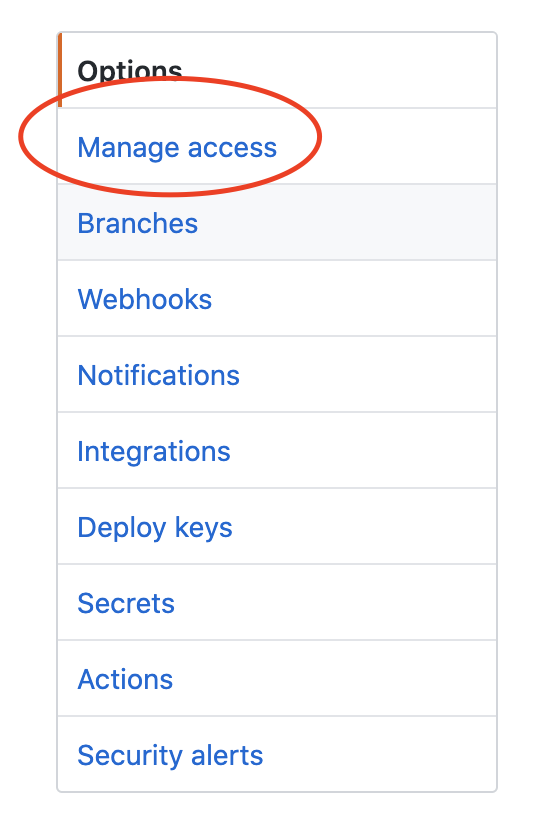
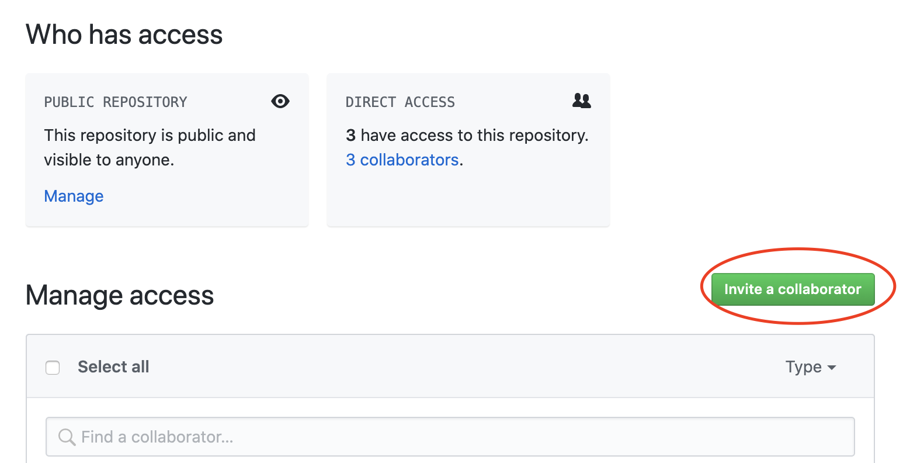

# Assignment Instructions #

CS 3230 assignment instructions. I will be adding instructions and any necessary files for assignments to this repo throughout the semester.

## Links to assignment instructions ##

### In-Class Exercise Instructions and Files ###

1. [Git Activity](in-class-exercises/01GitActivity.md)
2. [Git Visualizer](in-class-exercises/02GitVisualizer.md)
3. [Java Getting Started](in-class-exercises/03JavaGettingStarted.md)

### Assignment Instructions ###

1. [Assignment 1 Instructions](assignments/Assignment1.md)
2. [Assignment 2 Instructions](assignments/Assignment2.md)
3. [Assignment 3 Instructions](assignments/Assignment3.md)
4. [Assignment 4 Instructions](assignments/Assignment4.md)
5. [Assignment 5 Instructions](assignments/Assignment5.md)
6. [Final Project Instructions](FinalProject.md)

## Turning In Assignments ##

All assignments will be turned in using github pull requests. You will create a single repo and use branches for each assignment.

1. Create a new **private repo** in github for the assignment. You can name it whatever you like but I recommend something like: `cs3280Assignments`
2. Add `ethanbrown3` as a collaborator to that repo
   1. 
   2. 
   3. 
   4. 
      * The green button will not be grayed out after you select my username. 
3. Add a .gitignore file - [java-intellij-gitignore](https://www.gitignore.io/api/java,windows,intellij,macos)
4. For each assignment checkout at new branch.
    ```
    > git checkout -b assignment1
    > git push -u origin assignment1
    ```
5. Make frequent commits as you work on the assignment (this helps me track your progress and offer feedback)
6. When the assignment is completed, [create a pull request](PullRequests.md) in your github repo and be sure to put any information you think I need about your assignment in the comment box and set me as the reviewer.
7. Submit the link to the pull request on the assignment in canvas.

> **WARNING:** Please don't forget to make your repo private. If it is not private I won't grade it.

## Rubric ##

* Program Correctness - 50%
  * Program always works correctly according the specifications
  * All files needed for running the code are in the git repo
* Readability - 25%
  * Well organized code paths
  *  Consistent formatting
  * Descriptive naming (variables, methods, classes, etc)
  * No unnecessary commenting that clutters the code (keep comments to public facing pieces of code, if you are having to comment something inside a code block... it's too complicated or you naming isn't descriptive enough)
* Code Elegance - 15%
  * Minimal to no hardcoding
  * Loops are used responsibly (don't nest too much)
  * If statements are clean (no pyramids of doom)
  * switches are used responsibly
  * Nothing too "clever"
  * etc.
* Documentation - 10%
  * Public methods are commented well
  * Classes are commented well
